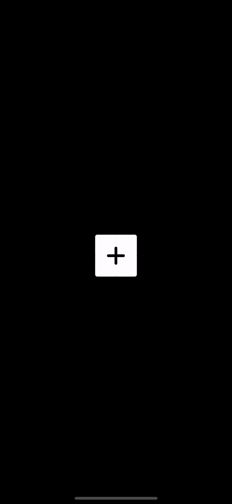

```swift
//
//  ContentView.swift
//  AddView
//
//  Created by Stephen DeStefano on 1/2/21.
//

import SwiftUI

struct ContentView: View {
    @State var isAnimating: Bool = false

    var body: some View {
        ZStack {
            Color.black.edgesIgnoringSafeArea(.all)
            ZStack {
                ExpandingView(expand: $isAnimating, direction: .bottom, symbolName: "note.text")
                ExpandingView(expand: $isAnimating, direction: .left, symbolName: "doc")
                ExpandingView(expand: $isAnimating, direction: .top, symbolName: "photo")
                ExpandingView(expand: $isAnimating, direction: .right, symbolName: "mic.fill")

                Image(systemName: "plus").font(.system(size: 40, weight: isAnimating ? .regular : .semibold, design: .rounded))
                    .foregroundColor(isAnimating ? Color.white : Color.black)
                    .rotationEffect(isAnimating ? .degrees(45) : .degrees(0))
                    .scaleEffect(isAnimating ? 3 : 1)
                    .opacity(isAnimating ? 0.5 : 1)
                    .animation(Animation.spring(response: 0.35, dampingFraction: 0.85, blendDuration: 1))
                    .onTapGesture {
                        isAnimating .toggle()
                    }
            }
        }

    }
}

struct ContentView_Previews: PreviewProvider {
    static var previews: some View {
        ContentView()
    }
}

//
//  ExpandingView.swift
//  AddView
//
//  Created by Stephen DeStefano on 1/2/21.
//

import SwiftUI

struct ExpandingView: View {

    @Binding var expand: Bool
    var direction: ExpandDirection
    var symbolName: String

    var body: some View {
        ZStack {
            ZStack {
                Image(systemName: symbolName)
                    .font(.system(size: 32, weight: .medium, design: .rounded))
                    .foregroundColor(Color.black).padding()
                    .scaleEffect(expand ? 1 : 0)
                    .rotationEffect(expand ? .degrees(-43) : .degrees(0))
                    .animation(.easeOut(duration: 0.15))
            }
            .frame(width: 82, height: 82)
            .background(Color.white)
            .cornerRadius(expand ? 41 : 8)
            .scaleEffect(expand ? 1 : 0.5)

            .offset(x: expand ? direction.offsets.0 : 0, y: expand ? direction.offsets.1 : 0)
            .rotationEffect(expand ? .degrees(43) : .degrees(0))
            .animation(Animation.easeOut(duration: 0.25).delay(0.05))
        }.offset(x: direction.containerOffset.0, y: direction.containerOffset.1)

    }
}

enum ExpandDirection {
    case bottom
    case left
    case right
    case top

    var offsets: (CGFloat, CGFloat) {
        switch self {
        case .bottom:
             return (32, 62)
        case .left:
            return (-62, 32)
        case .top:
            return (-32, -62)
        case .right:
            return (62, -32)
        }
    }

    var containerOffset: (CGFloat, CGFloat) {
        switch self {
        case .bottom:
            return (18, 18)
        case .left:
            return (-18, 18)
        case .top:
            return (-18, -18)
        case .right:
            return (18, -18)
        }
    }
}


struct ExpandingView_Previews: PreviewProvider {
    static var previews: some View {
        ExpandingView(expand: .constant(true), direction: .bottom, symbolName: "doc.fill")
    }
}


```
