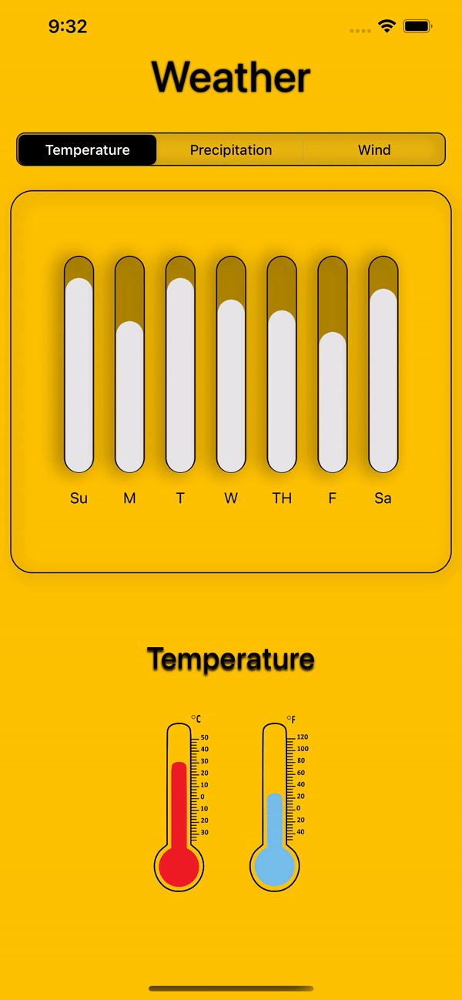

```swift
//
//  ContentView.swift
//  FairWeatherFriend
//
//  Created by paige on 2021/12/20.
//

import SwiftUI

struct DataModel {
    let day: String
    let data: CGFloat

    //weekly temperature data
    static let temperature: [DataModel] = [
        .init(day: "Su", data: 0.9),
        .init(day: "M", data: 0.7),
        .init(day: "T", data: 0.9),
        .init(day: "W", data: 0.8),
        .init(day: "TH", data: 0.75),
        .init(day: "F", data: 0.65),
        .init(day: "Sa", data: 0.85)]

    //weekly Precipitation data
    static let precipitation: [DataModel] = [
        .init(day: "Su", data: 0.4),
        .init(day: "M", data: 0.6),
        .init(day: "T", data: 0.2),
        .init(day: "W", data: 0.3),
        .init(day: "TH", data: 0.4),
        .init(day: "F", data: 0.9),
        .init(day: "Sa", data: 0.5)]

    //weekly wind percentage data
    static let wind: [DataModel] = [
        .init(day: "Su", data: 0.8),
        .init(day: "M", data: 0.4),
        .init(day: "T", data: 0.3),
        .init(day: "W", data: 0.3),
        .init(day: "TH", data: 0.5),
        .init(day: "F", data: 0.3),
        .init(day: "Sa", data: 0.2)]
}

struct ContentView: View {

    //array to hold the three weekly weather data options (an array of arrays)
    @State var dataArray = [DataModel.temperature, DataModel.precipitation, DataModel.wind]

    var capsuleWidth: CGFloat = 14
    @State private var pickerSelection = 0
    @State private var isOn = false
    @State private var animateTemp = false
    @State private var animatePrecip = false
    @State private var animateWind = false
    @State private var animateTempImage = false
    @State private var animatePrecipImage = false
    @State private var animateWindImage = false

    init() {
        //the forground color of each selected segment
        UISegmentedControl.appearance().selectedSegmentTintColor = .black
        //the color of the title for the selected segment
        UISegmentedControl.appearance().setTitleTextAttributes([.foregroundColor: UIColor.white], for: .selected)
        //the color of the title for the unselected segment
        UISegmentedControl.appearance().setTitleTextAttributes([.foregroundColor: UIColor.black], for: .normal)
    }

    var body: some View {
        ZStack {
            Color(.sRGB, red: 255/255, green: 195/255, blue: 0/255, opacity: 1).edgesIgnoringSafeArea(.all)
            VStack {
                //            SunMoonToggleView(isOn: $isOn)
                //MARK: - TITLE
                Text("Weather").font(.system(size: 40)).fontWeight(.medium).font(.title)
                    .shadow(color: .black, radius: 1, x: 0, y: 0)

                //MARK: - PICKER SEGMENT
                PickerView(pickerSelection: $pickerSelection)
                    .onReceive([pickerSelection].publisher.first()) { value in
                        if value == 0 {
                            //set the text labels for each segment on the picker
                            animateTemp = true
                            animatePrecip = false
                            animateWind = false
                            //set the images for each segment on the picker
                            animateTempImage = true
                            animatePrecipImage = false
                            animateWindImage = false
                        } else if value == 1 {
                            //set the text labels for each segment on the picker
                            animatePrecip = true
                            animateTemp = false
                            animateWind = false
                            //set the images for each segment on the picker
                            animateTempImage = false
                            animatePrecipImage = true
                            animateWindImage = false
                        } else if value == 2 {
                            //set the text labels for each segment on the picker
                            animateWind = true
                            animateTemp = false
                            animatePrecip = false
                            //set the images for each segment on the picker
                            animateTempImage = false
                            animatePrecipImage = false
                            animateWindImage = true
                        }
                    }

                //MARK: - WEEKLY GRAPH
                ZStack {
                    HStack (spacing: 20) {
                        WeeklyGraph(dayHeightData: dataArray[pickerSelection][0], width: (350) / capsuleWidth)
                        WeeklyGraph(dayHeightData: dataArray[pickerSelection][1], width: (350) / capsuleWidth)
                        WeeklyGraph(dayHeightData: dataArray[pickerSelection][2], width: (350) / capsuleWidth)
                        WeeklyGraph(dayHeightData: dataArray[pickerSelection][3], width: (350) / capsuleWidth)
                        WeeklyGraph(dayHeightData: dataArray[pickerSelection][4], width: (350) / capsuleWidth)
                        WeeklyGraph(dayHeightData: dataArray[pickerSelection][5], width: (350) / capsuleWidth)
                        WeeklyGraph(dayHeightData: dataArray[pickerSelection][6], width: (350) / capsuleWidth)
                    }
                    .animation(.spring(response: 0.9, dampingFraction: 0.6))

                    RoundedRectangle(cornerRadius: 20)
                        .stroke(lineWidth: 1).shadow(color: Color.black, radius: 8, x: 3, y: 3)
                        .padding(.horizontal,10)
                }

                GeometryReader { geo in
                    VStack {
                        if animateTemp {
                            Text("Temperature").fontWeight(.medium).font(.title).shadow(color: .black, radius: 1, x: 0, y: 2).transition(AnyTransition.offset(x: 300)).animation(Animation.easeOut(duration: 1.0), value: animateTemp)
                        }

                        if animatePrecip {
                            Text("Precipitation").fontWeight(.medium).font(.title).shadow(color: .black, radius: 1, x: 0, y: 2).transition(AnyTransition.offset(x: -300)).animation(Animation.easeOut(duration: 1.0), value: animatePrecip)
                        }

                        if animateWind {
                            Text("Wind").fontWeight(.medium).font(.title).shadow(color: .black, radius: 1, x: 0, y: 2).transition(AnyTransition.offset(x: 300)).animation(Animation.easeOut(duration: 1.0), value: animateWind)
                        }
                    }.position(x: geo.size.width * 0.5, y: geo.size.height * 0.2)

                    VStack {
                        if animateTempImage {
                            Image("tempImage").resizable().aspectRatio(contentMode: .fit)
                                .frame(width: geo.size.width / 2, height: geo.size.height / 2)
                                .position(y: geo.size.height / 2).transition(AnyTransition.offset(y: 300))
                                .animation(Animation.easeOut(duration: 1.0))
                        }

                        if animatePrecipImage {
                            Image("precip").resizable().aspectRatio(contentMode: .fit)
                                .frame(width: geo.size.width / 2, height: geo.size.height / 2)
                                .position(y: geo.size.height / 2).transition(AnyTransition.offset(x: 300))
                                .animation(Animation.easeOut(duration: 1.0))
                        }

                        if animateWindImage {
                            Image("wind").resizable().aspectRatio(contentMode: .fit)
                                .frame(width: geo.size.width / 2, height: geo.size.height / 2)
                                .position(y: geo.size.height / 2).transition(AnyTransition.offset(x: -300))
                                .animation(Animation.easeOut(duration: 1.0))
                        }
                    }.position(x: geo.size.width, y: geo.size.height * 0.6)
                }
            }
        }
    }
}
struct PickerView: View {

    @Binding var pickerSelection: Int

    var body: some View {
        Picker(selection: self.$pickerSelection, label: Text("")) {
            Text("Temperature").tag(0)
            Text("Precipitation").tag(1)
            Text("Wind").tag(2)
        }
        .pickerStyle(SegmentedPickerStyle())
        .background(RoundedRectangle(cornerRadius: 8)
                        .stroke(.black, lineWidth: 2)
                        .shadow(color: .black, radius: 8, x: 0, y: 0)
        )
        .cornerRadius(8)
        .padding(.horizontal, 15)
        .padding(.bottom, 15)
    }

}

struct WeeklyGraph: View {
    var dayHeightData: DataModel
    var width: CGFloat
    var body: some View {

        VStack {
            ZStack (alignment: .bottom) {
                Capsule().opacity(0.3)
                    .frame(width: width + 2, height: 200)
                    .background(RoundedRectangle(cornerRadius: 14).stroke(Color.black, lineWidth: 1))
                    .shadow(color: Color.black, radius: 9, x: -6, y: 0)
                Capsule()
                    .frame(width: width, height: dayHeightData.data * 200)
                    .overlay(RoundedRectangle(cornerRadius: 20).fill(Color.white).opacity(0.9))
            }.padding(.bottom, 8)
            Text(dayHeightData.day)
                .font(.system(size: 14))
        }
    }
}

struct ContentView_Previews: PreviewProvider {
    static var previews: some View {
        ContentView()
    }
}
```
