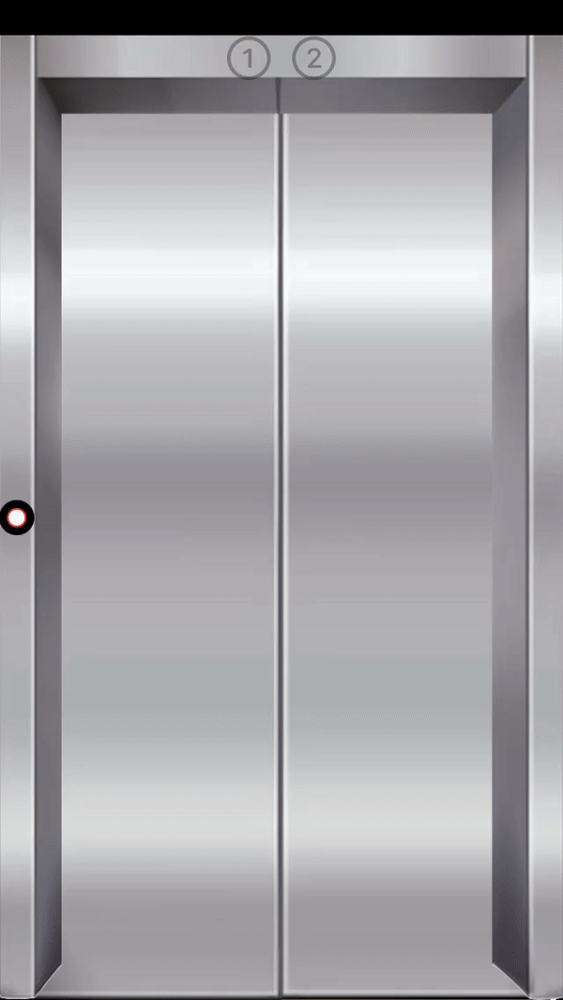

```swift
//
//  ContentView.swift
//  Elevator

import SwiftUI
import AVFoundation

var audioPlayer: AVAudioPlayer?

func playSound(sound: String, type: String) {
    if let path = Bundle.main.path(forResource: sound, ofType: type) {
        do {
            audioPlayer = try AVAudioPlayer(contentsOf: URL(fileURLWithPath: path))
            audioPlayer?.play()
        } catch {
            print("ERROR: Could not find and play the sound file!")
        }
    }
}

struct ContentView: View {
    var body: some View {
       Elevator()
    }
}

struct Elevator: View {
    @State private var doorsOpened = false
    @State private var floor1 = false
    @State private var floor2 = false
    @State private var animateSmiley = false
    @State private var floorCountDirection = false

    @State var doorOpenTimer: Timer? = nil
    @State var chimesSoundTimer: Timer? = nil
    @State var doorsOpenCloseSoundTimer: Timer? = nil

    let backgroundColor = Color(UIColor.black)

    var body: some View {
        ZStack {
            backgroundColor.edgesIgnoringSafeArea(.all)

            //MARK: - SMILEY
            Image("smiley").resizable().aspectRatio(contentMode: .fit)
                .scaleEffect(animateSmiley ? 1 : 0.01, anchor: .bottom)
                .animation(Animation.spring(response: 0.4, dampingFraction: 0.4).delay(2.5))

            //MARK: - FRAME AND DOORS
            FrameAndDoorsView(doorsOpened: $doorsOpened)

            //MARK: - BUTTON
            GeometryReader { geo in
                Button(action: {
                    stopTimer()
                    playDoorOpenCloseSound(interval: 0.5)
                    animateSmiley.toggle()
                    doorsOpened.toggle()
                    floorCountDirection.toggle()
                    floorNumbers()
                }) {
                    HStack(spacing: 8) {
                        if !doorsOpened {
                            Circle().frame(width: 10, height: 10).foregroundColor(.white)
                                .overlay(RoundedRectangle(cornerRadius: 30).stroke(Color.red, lineWidth: 1))
                        } else {
                            Circle().frame(width: 10, height: 10).foregroundColor(.black)
                                .overlay(RoundedRectangle(cornerRadius: 30).stroke(Color.red, lineWidth: 1))
                        }
                    }.padding(5)
                    .background(Color.black)
                    .cornerRadius(30)
                    .padding(8)
                }.position(x: (geo.size.width / 33), y: (geo.size.height / 2))

                //MARK: - FLOOR NUMBERS
                HStack {
                    Image(systemName: "1.circle").foregroundColor(.black)
                        .opacity(floor1 ? 1 : 0.3)
                    Image(systemName: "2.circle").foregroundColor(.black)
                        .opacity(floor2 ? 1 : 0.3)
                }.position(x: (geo.size.width / 2), y: (geo.size.height * 0.02) + 2)
                .font(.system(size: 25))
            }
        }
    }

    func openDoors() {
        doorOpenTimer = Timer.scheduledTimer(withTimeInterval: 8, repeats: false) { _ in
            doorsOpened.toggle()
        }
    }

    func playChimeSound() {
        chimesSoundTimer = Timer.scheduledTimer(withTimeInterval: 5.5, repeats: false) { _ in
            playSound(sound: "elevatorChime", type: "m4a")
        }
    }

    func playDoorOpenCloseSound(interval: TimeInterval) {
        doorsOpenCloseSoundTimer = Timer.scheduledTimer(withTimeInterval: interval, repeats: false) { _ in
            playSound(sound: "doorsOpenClose", type: "m4a")
        }
    }

    func stopTimer() {
        doorOpenTimer?.invalidate()
        doorOpenTimer = nil
        chimesSoundTimer?.invalidate()
        chimesSoundTimer = nil
        doorsOpenCloseSoundTimer?.invalidate()
        doorsOpenCloseSoundTimer = nil
    }

    func floorNumbers() {
        ///light up floor 1 as soon as the button is pressed, making sure floor 2 is not trye first
        if !floor2 {
            floor1.toggle()
        }
        ///check if the doors are opened, if not, lets keep the smiley true so it dosent disappear from view.
        ///open the doors and play the chime sound
        if !doorsOpened {
            animateSmiley.toggle()
            openDoors()
            playChimeSound()

            //going up
            if floorCountDirection {
                withAnimation(Animation.default.delay(4.0)) {
                    floor2 = true
                    floor1 = false
                }
                withAnimation(Animation.default.delay(5.0)) {
                    floor1 = true
                    floor2 = false
                    playDoorOpenCloseSound(interval: 8.5)
                }
                //going down
             } else if !floorCountDirection {
                withAnimation(Animation.default.delay(5.0)) {
                    floor1 = true
                    floor2 = false
                    playDoorOpenCloseSound(interval: 8.5)
                }
                withAnimation(Animation.default.delay(5.0)) {
                    floor2 = true
                    floor1 = false
                }
            }
        }
    }
}

struct FrameAndDoorsView: View {
    @Binding var doorsOpened: Bool

    var body: some View {
        ZStack {
            GeometryReader { geo in
                HStack {
                Image("leftDoor").resizable()
                    .frame(maxWidth: geo.size.width)
                    .offset(x: doorsOpened ? -geo.size.width / 2 : 4)

                    Image("rightDoor").resizable()
                    .frame(maxWidth: geo.size.width)
                        .offset(x: doorsOpened ? geo.size.width / 2 : -4)
                }
                Image("doorFrame").resizable()
                    .frame(maxWidth: geo.size.width, maxHeight: geo.size.height)
            }.animation(Animation.easeInOut.speed(0.09).delay(0.3))
        }
    }
}

struct ContentView_Previews: PreviewProvider {
    static var previews: some View {
        //ContentView().previewDevice("iPhone 8").previewDisplayName("iPhone 8")
        ContentView().previewDevice("iPhone 12").previewDisplayName("iPhone 12")
        ContentView().previewDevice("iPad Pro (9.7-inch)").previewDisplayName("iPad Pro (9.7 inch)")
    }
}
```
