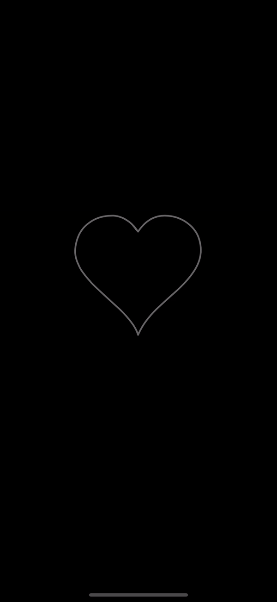

```swift
//
//  ContentView.swift
//  Heart Animate
//
//  Created by Stephen DeStefano on 12/29/20.
//

import SwiftUI

struct ContentView: View {

    //MARK: - VARIABLES
    @State var strokeReset: Bool = true
    @State var startStroke: CGFloat = 0.0
    @State var endStroke: CGFloat = 0.0

    var body: some View {
        ZStack {
            Color.black.edgesIgnoringSafeArea(.all)
            GeometryReader { geo in
                //MARK: - STATIONARY HEART SHAPE
                ZStack {
                    HeartShape()
                        .stroke(style: StrokeStyle(lineWidth: 2.5, lineCap: .round, lineJoin: .round))
                        .foregroundColor(.white)
                        .opacity(0.40)

                    //MARK: - ANIMATING HEART STROKE
                    HeartShape().trim(from: startStroke, to: endStroke)
                        .stroke(style: StrokeStyle(lineWidth: 6, lineCap: .round, lineJoin: .round))
                        .foregroundColor(Color.white)

                    //MARK: - HEART IMAGE
//                    Image("heart").resizable().aspectRatio(contentMode: .fit)
//                        .frame(width: 175, alignment: .center)
//                        .position(x: (geo.size.width / 4.1), y: (geo.size.height / 8.5))
                }.position(x: (geo.size.width / 1.3), y: (geo.size.height / 1.2))

                .onAppear() {
                    Timer.scheduledTimer(withTimeInterval: 0.15, repeats: true) { timer in
                        if (endStroke >= 1) {
                            if (strokeReset) {
                                Timer.scheduledTimer(withTimeInterval: 0.6, repeats: false) { _ in
                                    endStroke = 0
                                    startStroke = 0
                                    strokeReset.toggle()
                                }
                                strokeReset = false
                            }
                        }

                        withAnimation(Animation.easeOut) {
                            endStroke += 0.1
                            startStroke = endStroke - 0.3
                        }
                    }
                }
            }
        }
    }
}


struct ContentView_Previews: PreviewProvider {
    static var previews: some View {
        ContentView()
    }
}

//
//  HeartShape.swift
//  Heart Animate
//
//  Created by Stephen DeStefano on 12/29/20.
//

import SwiftUI

struct HeartShape: Shape {
    func path(in rect: CGRect) -> Path {
        var path = Path()

        path.move(to: CGPoint(x: 87.523697, y: 16.160114))

        path.addLine(to: CGPoint(x: 94.83223, y: 25.33009))
        path.addCurve(to: CGPoint(x: 134.494354, y: 1.502116), control1: CGPoint(x: 105.397995, y: 9.444774), control2: CGPoint(x: 118.618698, y: 1.502116))
        path.addCurve(to: CGPoint(x: 175.269913, y: 18.253372), control1: CGPoint(x: 150.369995, y: 1.502116), control2: CGPoint(x: 163.961853, y: 7.085868))
        path.addCurve(to: CGPoint(x: 188.63768, y: 51.604218), control1: CGPoint(x: 183.718719, y: 27.004593), control2: CGPoint(x: 188.174652, y: 38.12154))
        path.addCurve(to: CGPoint(x: 177.553986, y: 85.315872), control1: CGPoint(x: 189.100708, y: 62.404537), control2: CGPoint(x: 185.406143, y: 73.641754))
        path.addCurve(to: CGPoint(x: 145.505554, y: 119.469925), control1: CGPoint(x: 165.775726, y: 102.827042), control2: CGPoint(x: 147.153442, y: 117.831688))
        path.addCurve(to: CGPoint(x: 114.273895, y: 149.111938), control1: CGPoint(x: 143.857666, y: 121.108162), control2: CGPoint(x: 121.40519, y: 140.574234))
        path.addCurve(to: CGPoint(x: 94.83223, y: 179), control1: CGPoint(x: 107.142601, y: 157.649643), control2: CGPoint(x: 101.513939, y: 164.199234))
        path.addCurve(to: CGPoint(x: 66.681847, y: 140.070801), control1: CGPoint(x: 92.074852, y: 168.586487), control2: CGPoint(x: 82.691391, y: 155.610092))
        path.addCurve(to: CGPoint(x: 23.687181, y: 99.654457), control1: CGPoint(x: 39.076797, y: 115.135979), control2: CGPoint(x: 24.745241, y: 101.663864))
        path.addCurve(to: CGPoint(x: 5.790202, y: 74.38588), control1: CGPoint(x: 13.931859, y: 88.938652), control2: CGPoint(x: 7.966199, y: 80.515793))
        path.addCurve(to: CGPoint(x: 0.843276, y: 52.375896), control1: CGPoint(x: 2.066102, y: 66.714325), control2: CGPoint(x: 0.417127, y: 59.377666))
        path.addCurve(to: CGPoint(x: 5.790202, y: 31.67514), control1: CGPoint(x: 1.269424, y: 45.374126), control2: CGPoint(x: 2.9184, y: 38.473873))
        path.addCurve(to: CGPoint(x: 25.33061, y: 9.676332), control1: CGPoint(x: 9.565499, y: 22.793488), control2: CGPoint(x: 16.078968, y: 15.460552))
        path.addCurve(to: CGPoint(x: 58.643883, y: 1.502116), control1: CGPoint(x: 34.582249, y: 3.89211), control2: CGPoint(x: 45.686676, y: 1.167372))
        path.addCurve(to: CGPoint(x: 87.001564, y: 15.606998), control1: CGPoint(x: 69.245621, y: 2.455707), control2: CGPoint(x: 78.698181, y: 7.157334))
        path.addCurve(to: CGPoint(x: 93.141487, y: 23.3118), control1: CGPoint(x: 90.344658, y: 19.008989), control2: CGPoint(x: 92.433952, y: 22.589443))
        path.addCurve(to: CGPoint(x: 87.523697, y: 16.160114), control1: CGPoint(x: 93.841354, y: 24.026325), control2: CGPoint(x: 91.968758, y: 21.642431))
        path.closeSubpath()
        path.move(to: CGPoint(x: 87.523697, y: 16.160114))

        return path
    }
}


struct HeartShape_Previews: PreviewProvider {
    static var previews: some View {
        ZStack {
            Color.black
                .edgesIgnoringSafeArea(.all)
            HeartShape().offset(x: 100, y: 200)
                .stroke(style: StrokeStyle(lineWidth: 6))
                .foregroundColor(.white)
        }
    }
}

```
